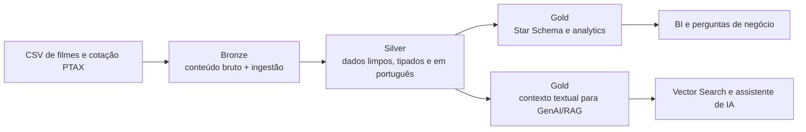
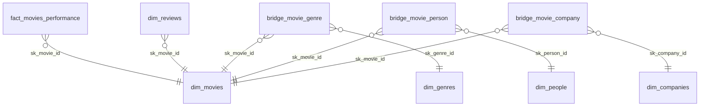

# Engenharia de Dados | Visagio Rocket Lab 2026.2

## CineData Analytics — Pipeline de Dados

Pipeline de dados de filmes desenvolvido no Databricks para o Rocket Lab 2026.2 de Engenharia de Dados. O projeto transforma cinco arquivos CSV e dados de cotação PTAX em tabelas Delta organizadas pela Arquitetura Medalhão:

```text
Landing -> Bronze -> Silver -> Gold
```

O resultado atende três objetivos:

- preservar os dados recebidos e sua rastreabilidade;
- disponibilizar um modelo dimensional para BI e consultas analíticas;
- construir uma tabela de contexto textual para aplicações de GenAI e RAG.

## Contexto

Os arquivos combinam informações do TMDB e do IMDb sobre filmes, finanças, métricas, avaliações, gêneros, pessoas e produtoras. A origem contém problemas intencionais e naturais de qualidade, como valores textuais em colunas numéricas, datas em múltiplos formatos, separadores diferentes, column shift, duplicidades e registros sem correspondência entre arquivos.

O pipeline trata esses problemas em etapas separadas. A Bronze preserva o conteúdo recebido, a Silver aplica limpeza e tipagem e a Gold organiza os dados para consumo analítico.

## Tecnologias

| Tecnologia | Uso |
|---|---|
| Databricks | Execução dos notebooks e do Workflow |
| PySpark | Leitura, transformação, validação e escrita distribuída |
| Spark SQL | Consultas analíticas e validações no catálogo |
| Delta Lake | Persistência das tabelas em todas as camadas |
| Unity Catalog | Organização dos schemas e governança |
| API PTAX do Banco Central | Cotação de compra do dólar para conversão USD/BRL |
| Databricks Workflows | Orquestração das tarefas Bronze, Silver e Gold |

## Estrutura do repositório

```text
.
├── configuracao/
│   └── databricks/
│       └── job.yaml
├── evidencias/
│   └── workflow/
│       ├── successful-run.png
│       ├── successful-run-graph.png
│       └── workflow-tasks.png
├── notebooks/
│   ├── Landing_to_Bronze.ipynb
│   ├── Bronze_to_Silver.ipynb
│   └── Silver_to_Gold.ipynb
└── README.md
```

Os CSVs utilizados na validação local podem permanecer no diretório do projeto, mas no Databricks devem ser enviados para o Volume configurado no notebook de ingestão.

## Arquitetura Medalhão



## Fontes de dados

| Arquivo | Conteúdo |
|---|---|
| `movies_info_TMDB_IMDB.csv` | Títulos, datas, status, duração, idioma e sinopses |
| `movies_financials_IMDB_TMDB.csv` | Orçamento, receita e valores financeiros |
| `movies_metrics_IMDB_TMDB.csv` | Popularidade, notas e quantidade de votos |
| `movies_reviews.csv` | Avaliações e comentários de usuários |
| `credits_and_tags_IMDB_TMDB.csv` | Gêneros, atores, diretores, roteiristas e produtoras |
| API PTAX do Banco Central | Cotação de compra do dólar |

O caminho padrão dos CSVs é configurado pelo widget `input_base_path`:

```text
/Volumes/workspace/default/inputs
```

## Camada Bronze

Notebook: [`Landing_to_Bronze.ipynb`](notebooks/Landing_to_Bronze.ipynb)

A Bronze é a camada de preservação. Os arquivos são lidos sem tentar corrigir o conteúdo e as colunas permanecem como `STRING` durante a ingestão.

Principais regras:

- leitura com `header`, `multiLine`, `quote` e `escape` configurados para o padrão dos CSVs;
- modo permissivo para não interromper toda a carga por causa de uma linha problemática;
- inclusão de `ingestion_datetime` para rastrear cada carga;
- gravação em Delta no modo `append`, preservando o histórico;
- validação do formato Delta e da presença da coluna de ingestão;
- consulta parametrizada da API PTAX com datas no formato `MM-DD-AAAA`;
- consulta de sete dias corridos, incluindo dias anteriores para fornecer uma semente ao forward fill da Silver.

| Tabela Bronze | Origem |
|---|---|
| `bronze.tb_movies_info` | `movies_info_TMDB_IMDB.csv` |
| `bronze.tb_movies_financials` | `movies_financials_IMDB_TMDB.csv` |
| `bronze.tb_movies_metrics` | `movies_metrics_IMDB_TMDB.csv` |
| `bronze.tb_credits_and_tags` | `credits_and_tags_IMDB_TMDB.csv` |
| `bronze.tb_movies_reviews` | `movies_reviews.csv` |
| `bronze.tb_cotacao_dolar` | resposta da API PTAX |

## Camada Silver

Notebook: [`Bronze_to_Silver.ipynb`](notebooks/Bronze_to_Silver.ipynb)

A Silver transforma os dados para o formato de consumo. Os nomes são convertidos para português, os tipos são tratados explicitamente e as regras de qualidade ficam registradas no notebook.

As conversões numéricas e temporais usam `try_cast` e `try_to_timestamp`. Essa escolha é importante no Databricks Serverless, que pode operar com ANSI mode: um `cast` comum poderia interromper toda a execução ao encontrar uma linha suja. Valores incompatíveis são convertidos em `NULL` e as validações registram os casos que precisam de auditoria.

| Tabela Silver | Principais tratamentos |
|---|---|
| `silver.tb_info_filmes` | Deduplicação pela ingestão mais recente; status normalizado, traduzido e valores não mapeáveis convertidos para `Não Informado`; datas interpretadas em formatos como `AAAA-MM-DD`, `DD/MM/AAAA`, `DD-MM-AAAA`, `MM-DD-AAAA`, `AAAA/MM/DD`, `DD.MM.AAAA` e `AAAAMMDD`; títulos com caixa totalmente alta ou baixa padronizados; duração tipada; `ano_lancamento` derivado |
| `silver.tb_financeiro_filmes` | Marcadores de ausência convertidos em `NULL`; remoção de símbolos monetários e separadores; interpretação de formatos com ponto e vírgula; expansão dos sufixos `K`, `M` e `B`; valores zero ou negativos invalidados; conversão para BRL pela cotação PTAX mais recente; lucro e margem calculados com propagação segura de nulos e sem divisão por zero |
| `silver.tb_metricas_engajamento` | Separadores decimais normalizados; conversão segura de decimais e inteiros; evidências de deslocamento de colunas identificadas antes de invalidar a popularidade; notas fora de `0` a `10`, contagens negativas e popularidade negativa convertidas em `NULL` |
| `silver.tb_avaliacoes_usuarios` | Duplicatas integrais removidas pela combinação filme, usuário, nota e comentário; notas fora da escala convertidas em `NULL`; comentários vazios ou compostos apenas por espaços preenchidos com `Sem comentário` |
| `silver.tb_generos` | Separadores por vírgula, ponto e vírgula e barra vertical padronizados; listas divididas com `split` e `explode`; seleção dos 19 gêneros válidos; remoção de valores vazios, numéricos e resíduos fora do domínio |
| `silver.tb_pessoas_empresas` | Quatro categorias de origem unificadas em uma relação: `Ator`, `Diretor`, `Roteirista` e `Produtora`; listas divididas e explodidas; capitalização e espaços padronizados; marcadores de ausência, datas, números, idiomas, gêneros e outros resíduos de deslocamento classificados e removidos; relações duplicadas eliminadas |
| `silver.tb_cotacao_dolar` | Histórico diário deduplicado; calendário contínuo construído para o período solicitado; cotação-semente identificada; forward fill aplicado para fins de semana e feriados; data de origem e indicador de preenchimento preservados para auditoria |

### Chaves naturais e obras canônicas

`id_filme` permanece igual ao `id` recebido da Bronze. Ele é a chave natural do registro no modelo físico e não é substituído por uma chave criada artificialmente.

A Silver também preserva `id_imdb` e cria `id_obra_canonica` como campo auxiliar. Quando existe um `tconst` válido, ele é usado para agrupar IDs diferentes que representam a mesma obra. Quando o IMDb não está disponível, o notebook usa título normalizado e data de lançamento como fallback.

Essa separação evita confundir duas coisas diferentes:

- o registro técnico recebido da origem, identificado por `id_filme`;
- a obra cinematográfica, identificada por `id_obra_canonica`.

Neste projeto, uma **obra canônica** é a representação única de uma obra cinematográfica depois que seus cadastros repetidos são agrupados. O agrupamento prioriza o mesmo `tconst` do IMDb; assim, títulos como `Die Hart 2`, `DIE HART 2: DIE HARTER` e `Duro de Atuar 2` não são tratados como obras diferentes quando pertencem ao mesmo identificador IMDb. O termo é usado para deixar claro que a contagem mede obras distintas, e não a quantidade de IDs técnicos recebidos da origem.

## Camada Gold

Notebook: [`Silver_to_Gold.ipynb`](notebooks/Silver_to_Gold.ipynb)

A Gold publica o modelo dimensional, as tabelas-ponte, a tabela de contexto para GenAI e as seis consultas de negócio.

### Star Schema



| Tabela | Tipo | Finalidade |
|---|---|---|
| `gold.fact_movies_performance` | Fato | Uma linha por `id_filme` lançado, com métricas financeiras e de engajamento |
| `gold.dim_movies` | Dimensão | Metadados do catálogo, incluindo `id_filme` e `id_obra_canonica` |
| `gold.dim_genres` | Dimensão | Catálogo deduplicado de gêneros |
| `gold.dim_people` | Dimensão | Atores, diretores e roteiristas |
| `gold.dim_companies` | Dimensão | Produtoras e estúdios |
| `gold.dim_reviews` | Dimensão | Quantidade e média das avaliações por filme |
| `gold.bridge_movie_genre` | Bridge | Relação entre filmes e gêneros |
| `gold.bridge_movie_person` | Bridge | Relação entre filmes e pessoas |
| `gold.bridge_movie_company` | Bridge | Relação entre filmes e produtoras |

As chaves substitutas são geradas com `sha2`, reduzidas a 60 bits e convertidas para `BIGINT`. Dessa forma, permanecem estáveis entre reprocessamentos. O notebook valida unicidade, colisões, grão da fato e integridade referencial antes de publicar as tabelas.

As tabelas-ponte evitam multiplicar as linhas da fato em joins muitos-para-muitos. Métricas financeiras são somadas na fato; as pontes são usadas para relacionar dimensões e contar filmes distintos.

### Grão técnico e regra canônica nas análises

O Star Schema mantém o grão técnico de `id_filme`, necessário para preservar a rastreabilidade da origem. A pergunta 5 publica duas leituras claramente separadas:

- a resposta principal segue o grão físico da atividade e conta filmes distintos por `sk_movie_id`;
- a análise complementar conta obras distintas por `id_obra_canonica`, evitando que vários IDs da mesma obra inflem a métrica.

A diferença é relevante no conjunto analisado: Kevin Hart aparece em 64 IDs no recorte de dois anos, mas esses IDs correspondem a duas obras canônicas. Já Suhas lidera a visão canônica com quatro obras. Assim, as duas respostas não são concorrentes: cada uma explicita o grão que está medindo.

Na pergunta 6, o lucro continua consolidado uma vez por obra e produtora. O agrupamento canônico prioriza o `tconst` do IMDb; título normalizado e data de lançamento são usados apenas como fallback, pois títulos e datas também apresentam variações na origem.

### Tabela de contexto para GenAI

Tabela: `gold.gold_genai_movies_context`

| Coluna | Descrição |
|---|---|
| `movie_id` | Chave natural do filme para rastreabilidade |
| `title` | Título legível |
| `llm_context_document` | Documento em texto corrido para vetorização |

O documento combina título, ano, receita, orçamento, atores, diretores e sinopse em uma frase. Cada campo recebe um fallback antes do `concat`, evitando que um valor nulo faça o documento inteiro desaparecer.

Como a origem não informa uma ordem confiável de protagonismo, o contexto agrega os atores disponíveis sem inventar uma classificação de atores principais.

## Consultas analíticas

O notebook Gold responde às perguntas previstas na atividade:

1. receita total em reais;
2. cinco filmes com maior popularidade;
3. quantidade de filmes por gênero;
4. dez filmes com maior receita em USD e BRL, usando `RANK()`;
5. ator com mais participações nos dois anos mais recentes, com a resposta principal por filme e uma análise complementar por obra canônica;
6. produtora com maior lucro nos cinco anos mais recentes.

As janelas temporais usam a maior data de lançamento realizada da base, ignorando datas futuras e filmes que não estejam lançados. Os limites são inclusivos e calculados com `add_months`.

### Resultados da execução

Os valores abaixo foram transcritos da execução do notebook Gold no Databricks. A data de referência das perguntas 5 e 6 foi `2026-02-19`.

#### 1. Receita total

| Métrica | Resultado |
|---|---:|
| Receita total em BRL | R$ 837.771.586.093,11 |

#### 2. Cinco filmes com maior popularidade

| Posição | Filme | Popularidade |
|---:|---|---:|
| 1 | Blue Beetle | 2994,357 |
| 2 | Gran Turismo | 2680,593 |
| 3 | The Nun II | 1692,778 |
| 4 | Meg 2: The Trench | 1567,273 |
| 5 | Retribution | 1547,220 |

#### 3. Quantidade de filmes por gênero

| Gênero | Quantidade |
|---|---:|
| Drama | 32.356 |
| Documentary | 19.101 |
| Comedy | 18.680 |
| Thriller | 10.291 |
| Horror | 9.753 |
| Romance | 7.657 |
| Action | 6.070 |
| Crime | 4.757 |
| Animation | 4.488 |
| TV Movie | 4.088 |
| Science Fiction | 3.779 |
| Family | 3.728 |
| Mystery | 3.320 |
| Fantasy | 3.283 |
| Adventure | 2.875 |

#### 4. Dez filmes com maior receita

| Posição | Filme | Receita USD | Receita BRL |
|---:|---|---:|---:|
| 1 | Avengers: Endgame | US$ 2.800.000.000,00 | R$ 14.439.320.000,00 |
| 2 | Avatar: The Way of Water | US$ 2.320.250.281,00 | R$ 11.965.298.674,09 |
| 3 | Avengers: Infinity War | US$ 2.052.415.039,00 | R$ 10.584.099.114,62 |
| 4 | Spider-Man: No Way Home | US$ 1.921.847.111,00 | R$ 9.910.773.366,72 |
| 5 | The Lion King | US$ 1.663.075.401,00 | R$ 8.576.313.535,42 |
| 6 | Top Gun: Maverick | US$ 1.488.732.821,00 | R$ 7.677.724.628,41 |
| 7 | Barbie | US$ 1.428.545.028,00 | R$ 7.366.863.854,89 |
| 8 | The Super Mario Bros. Movie | US$ 1.355.725.263,00 | R$ 6.991.339.608,76 |
| 9 | Black Panther | US$ 1.349.926.083,00 | R$ 6.961.433.817,42 |
| 10 | Star Wars: The Last Jedi | US$ 1.332.698.830,00 | R$ 6.872.594.596,43 |

#### 5. Ator com maior participação nos últimos dois anos

Resposta principal conforme o grão de filme da atividade (`sk_movie_id`):

| Posição | Ator | Filmes |
|---:|---|---:|
| 1 | Kevin Hart | 64 |

Análise complementar após consolidar IDs equivalentes (`id_obra_canonica`):

| Posição | Ator | Obras canônicas |
|---:|---|---:|
| 1 | Suhas | 4 |

#### 6. Produtora com maior lucro nos últimos cinco anos

| Posição | Produtora | Lucro USD | Lucro BRL | Obras com lucro conhecido |
|---:|---|---:|---:|---:|
| 1 | Universal Pictures | US$ 5.772.329.679,00 | R$ 29.767.326.921,64 | 24 |

Esses resultados são um retrato da execução registrada. Se os CSVs, a cotação ou as regras de tratamento forem atualizados, o notebook deve ser executado novamente e esta seção deve ser revisada.

## Achados de qualidade de dados

| Problema | Tratamento |
|---|---|
| CSVs com quebras de linha e aspas internas | Bronze usa `multiLine`, `quote` e `escape` explícitos |
| Valores textuais em colunas numéricas | Conversão segura e invalidação controlada |
| Datas em formatos diferentes | Tentativa ordenada de múltiplos formatos |
| Column shift em métricas e entidades | Cast seguro, classificação de resíduos e filtros de domínio |
| Gêneros com separadores diferentes | Padronização antes de `split` e `explode` |
| IDs duplicados na origem | Deduplicação por carga e identificação auxiliar da obra canônica |
| Fontes com IDs sem filme correspondente | Aviso na Gold e descarte do vínculo órfão, sem inventar dimensões |
| Relações muitos-para-muitos | Tabelas-ponte e contagens distintas |

## Decisões técnicas

### Bronze como `STRING`

A ingestão não tenta inferir tipos. Assim, valores como símbolos monetários, vírgulas decimais e textos deslocados permanecem disponíveis para tratamento na Silver.

### `try_cast` e `try_to_timestamp`

O Serverless pode operar com ANSI mode. Conversões comuns poderiam interromper o pipeline quando encontrassem texto inválido; as funções seguras transformam apenas os valores incompatíveis em `NULL`.

### Lucro desconhecido não é zero

Se orçamento ou receita estiverem ausentes, o lucro permanece `NULL`. Substituir a ausência por zero inventaria margens e poderia alterar o ranking de produtoras.

### Cotação PTAX mais recente

Os filmes não possuem data de transação. Por isso, a conversão para BRL usa a cotação mais recente disponível, registrada junto das métricas financeiras para permitir rastreabilidade.

### Bronze em append e Silver/Gold em overwrite

A Bronze preserva o histórico de cargas. Silver e Gold são reconstruídas a partir da Bronze completa, o que torna as transformações idempotentes e evita duplicação a cada execução.

### Dimensão completa e fato de lançados

`dim_movies` descreve o catálogo completo. `fact_movies_performance` mantém somente filmes lançados, com uma linha por registro natural de filme e métricas opcionais em `NULL` quando não existem.

## Orquestração

O Workflow está definido em [`configuracao/databricks/job.yaml`](configuracao/databricks/job.yaml):

```text
to_Bronze -> to_Silver -> to_Gold
```

As dependências são explícitas. Silver só inicia após Bronze e Gold só inicia após Silver. O Job está agendado para `At 12:00 AM (UTC-03:00 — America/Sao_Paulo)`.

Evidências disponíveis:

- [`workflow-tasks.png`](evidencias/workflow/workflow-tasks.png): tarefas, dependências e agendamento;
- [`successful-run-graph.png`](evidencias/workflow/successful-run-graph.png): execução concluída com sucesso e dependências entre as tarefas;
- [`successful-run.png`](evidencias/workflow/successful-run.png): histórico de execuções bem-sucedidas do Job.

## Como executar

### Pré-requisitos

- Workspace Databricks com permissão para criar tabelas e Jobs;
- compute Serverless ou cluster com PySpark;
- cinco CSVs carregados no Volume de entrada;
- acesso à API PTAX durante a execução da Landing, ou uma resposta previamente disponibilizada conforme a política do ambiente.

### Execução manual

1. Importe os três notebooks da pasta `notebooks/` para o Workspace.
2. Confirme ou ajuste o widget `input_base_path`.
3. Execute `Landing_to_Bronze.ipynb`.
4. Execute `Bronze_to_Silver.ipynb` após a conclusão da Bronze.
5. Execute `Silver_to_Gold.ipynb` após a conclusão da Silver.
6. Confira as validações e os resultados exibidos nas células finais.

### Execução pelo Workflow

1. Importe ou configure o Job a partir de `configuracao/databricks/job.yaml`.
2. Confirme os caminhos dos notebooks no Workspace.
3. Verifique as dependências Bronze -> Silver -> Gold.
4. Execute manualmente ou aguarde o agendamento.
5. Confirme que as três tarefas terminam com sucesso.

## Limitações conhecidas

- O Free Edition pode restringir chamadas externas a partir do Serverless. Nesse caso, a resposta PTAX precisa ser obtida conforme a política do ambiente e disponibilizada para a ingestão.
- Os filmes não possuem data de transação; a cotação mais recente é uma aproximação necessária para a conversão em BRL.
- A origem possui várias linhas com IDs diferentes para uma mesma obra. O modelo preserva esses IDs para rastreabilidade e usa `id_obra_canonica` nas análises que medem obras distintas.
- A origem não fornece uma ordem confiável de protagonismo. O contexto RAG agrega os atores encontrados, sem afirmar que sejam os protagonistas.
- Ainda existem registros órfãos entre algumas fontes Silver. Eles são identificados nas validações e não geram filmes artificiais na Gold.
- O tratamento de column shift remove padrões conhecidos. Resíduos raros e não observados podem exigir revisão caso apareçam em novas cargas.
